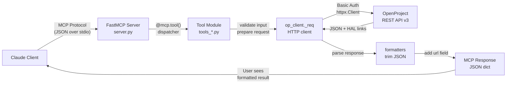

# System Architecture — openproject-mcp

## Request Flow Diagram



## Component Overview

### 1. FastMCP Server (`server.py`)

**Responsibility:** Entry point; tool registration via side effects

```python
# Imports tools_*.py for @mcp.tool() registration
import tools_admin, tools_coder, tools_news, ...
from app import mcp

__version__ = "0.4.0"

def main() -> None:
    log.info("openproject-mcp v%s — base_url=%s", __version__, BASE_URL)
    mcp.run()  # Blocks; handles stdio forever
```

**Characteristics:**
- Minimal; 47 LOC
- Runs forever on `mcp.run()`
- Logs startup info to stderr
- Tool registration happens at import time (side effects)

### 2. FastMCP App Instance (`app.py`)

**Responsibility:** Shared FastMCP instance for tool registration

```python
from mcp.server.fastmcp import FastMCP
mcp = FastMCP("openproject")
```

**Why separate?** Allows `tools_*.py` modules to import and decorate without circular imports.

### 3. Configuration (`config.py`)

**Responsibility:** Environment variables, logging

```python
import os, logging, sys

BASE_URL = os.environ.get("OPENPROJECT_URL", "").rstrip("/")
API_KEY = os.environ.get("OPENPROJECT_API_KEY", "")
TIMEOUT = float(os.environ.get("OPENPROJECT_TIMEOUT_SECONDS", "30"))

logging.basicConfig(stream=sys.stderr, ...)  # stdout reserved for MCP
log = logging.getLogger("openproject-mcp")
```

**Key decisions:**
- No `.env` file (env vars only)
- Logs to stderr (stdout reserved for MCP protocol)
- No API key in logs (only `api_key_set=True/False`)
- Timeout configurable per request

### 4. HTTP Client (`op_client.py`)

**Responsibility:** Shared httpx.Client, retry logic, error handling, pagination

**Key exports:**

| Function | Purpose |
|----------|---------|
| `_req(method, path, **kwargs)` | Low-level request with Basic Auth, retry, error handling |
| `_collection(path, **params)` | Paginated GET with offset/limit |
| `client` | Shared httpx.Client for connection reuse |

**Retry logic:**

```python
if method == "POST":
    # POST never retries (write-once semantics)
    return response
elif status in (429, 5xx):
    # GET/PATCH/DELETE retry once on transient failure
    wait_time = int(response.headers.get("Retry-After", "1"))
    sleep(wait_time)
    return retry_request()
```

**Auth:**
```python
client = httpx.Client(
    auth=("apikey", API_KEY),
    timeout=TIMEOUT,
    base_url=BASE_URL,
)
```

**Error handling:**

```python
if response.status_code == 401:
    raise ValueError("Invalid or expired API key. Generate new one...")
elif response.status_code == 403:
    raise ValueError("Insufficient permission. Your role lacks access...")
elif response.status_code == 404:
    raise ValueError(f"Not found: {path}")
```

### 5. Formatters (`formatters.py`)

**Responsibility:** Trim HAL+JSON responses, extract useful fields, convert timestamps

**Key helpers:**

| Function | Purpose |
|----------|---------|
| `_fmt_wp(api_response)` | Work package: id, subject, status, project, assignee, due, url |
| `_fmt_news(api_response)` | News: id, title, summary, created_on, url |
| `_href_id(link)` | Extract numeric ID from `/api/v3/users/42` |
| `_link_title(item, rel_name)` | Get linked item title (e.g., project name) |
| `iso8601_to_hours(duration)` | Convert ISO 8601 (PT2H) to float (2.0) |
| `_out(obj, plural=False)` | Wrap result dict with metadata |

**Example: `_fmt_wp`**

Input: HAL+JSON response from OpenProject API
```json
{
  "id": 123,
  "subject": "Fix login bug",
  "description": "...",
  "status": {"id": 1, "name": "New"},
  "project": {"id": 42, "name": "Website"},
  "assignee": {"id": 5, "name": "Alice"},
  "dueDate": "2026-06-15",
  "lockVersion": 3,
  "_links": {"self": {"href": "/api/v3/work_packages/123"}}
}
```

Output: Trimmed dict
```python
{
    "id": 123,
    "subject": "Fix login bug",
    "status": {"id": 1, "name": "New"},
    "project": {"id": 42, "name": "Website"},
    "assignee": {"id": 5, "name": "Alice"},
    "due_date": "2026-06-15",
    "url": "https://openproject.example.com/work_packages/123"
}
```

### 6. Validators (`validators.py`)

**Responsibility:** Pure validation for relation operations

**Key function: `validate_relation(source_id, target_id, relation_type)`**

Rejects:
- **Self-relation:** source == target
- **Duplicate:** already exists in either direction
- **Direct cycle:** `blocks` + `precedes` reversal (A blocks B, B precedes A = cycle)

**RELATION_TYPES**
```python
RELATION_TYPES = [
    "relates", "duplicates", "duplicated_by", "blocks", "blocked_by",
    "precedes", "follows", "includes", "partof", "requires", "required_by"
]
```

**Rationale:** Prevent invalid API calls; catch errors before network round-trip.

### 7-13. Tool Modules (`tools_*.py`)

**Pattern:** Each module imports `app.mcp`, decorates functions with `@mcp.tool()`, implements tool logic.

| Module | Tools | Area |
|--------|-------|------|
| `tools_work_packages.py` | 5 | Work package CRUD + comments |
| `tools_projects.py` | 7 | Projects, members, metadata |
| `tools_coder.py` | 3 | Hierarchy, relations |
| `tools_time.py` | 3 | Time tracking |
| `tools_reports.py` | 7 | Analytics & reporting |
| `tools_news.py` | 5 | News CRUD |
| `tools_admin.py` | 8 | User/role/project admin |

**Tool signature pattern:**
```python
@mcp.tool()
def create_work_package(
    project_id: int,
    subject: str,
    type_id: int = None,
    parent_id: int = None,
) -> dict:
    """Tạo work package mới. [Vietnamese docstring with all params]"""
    
    # Validate input
    if not subject.strip():
        raise ValueError("Subject cannot be empty")
    
    # Call API
    payload = {"subject": subject, "typeId": type_id, ...}
    response = _req("POST", f"/api/v3/projects/{project_id}/work_packages", json=payload)
    
    # Format & return
    return _fmt_wp(response.json())
```

## Request Lifecycle

### Example: `create_work_package`

```
1. Claude: "Create a task 'Fix login bug' in project 42"
   ↓
2. MCP Client dispatches to tool: create_work_package(project_id=42, subject="Fix login bug")
   ↓
3. Tool validates:
   - project_id is int ✓
   - subject is non-empty string ✓
   ↓
4. Tool calls op_client._req("POST", "/api/v3/projects/42/work_packages", json=...)
   ↓
5. _req builds request:
   - Base URL: https://openproject.example.com
   - Auth: Basic auth (username="apikey", password=API_KEY)
   - Timeout: 30s (or OPENPROJECT_TIMEOUT_SECONDS)
   ↓
6. httpx.Client sends over HTTP
   ↓
7. OpenProject API v3 responds:
   - Status 201 Created
   - Body: {"id": 999, "subject": "Fix login bug", ...}
   ↓
8. _req checks status:
   - 201 is success
   - Don't retry (POST never retries)
   - Return response object
   ↓
9. Tool calls formatters._fmt_wp(response.json())
   - Trim to essential fields
   - Extract url from _links.self.href
   ↓
10. Tool returns:
    {
        "id": 999,
        "subject": "Fix login bug",
        "project": {"id": 42},
        "status": {"name": "New"},
        "url": "https://openproject.example.com/work_packages/999"
    }
    ↓
11. MCP Client returns to Claude
    ↓
12. Claude: "Done! Created task #999 'Fix login bug' in project Website."
```

## Authentication Model

**OpenProject API v3 uses HTTP Basic Authentication:**

```
Authorization: Basic base64(apikey:TOKEN)
```

**Our implementation:**
```python
# In config.py
API_KEY = os.environ.get("OPENPROJECT_API_KEY")  # Personal token, 40 hex chars

# In op_client.py
client = httpx.Client(auth=("apikey", API_KEY), ...)
```

**Security:**
- Username always `"apikey"` (hardcoded)
- Password is token from env (never logged, never committed)
- All communication over HTTPS (enforced by OpenProject)
- If token leaked: revoke at `My account → Access tokens → API` and generate new one

## Idempotency & Retry Strategy

**Idempotent requests (can safely retry):**
- `GET` — read-only, safe to retry
- `PATCH` — update with optimistic locking via `lockVersion`, safe to retry
- `DELETE` — can retry if idempotent (some deletions have side effects; caution in guides)

**Non-idempotent requests (must NOT retry):**
- `POST` — creates new resource; retry risks duplicate (task, relation, time entry, member, news item)

**Implementation:**
```python
def _req(method, path, **kwargs):
    response = client.request(method, path, **kwargs)
    
    if method == "POST":
        # Never retry POST
        return response
    
    if response.status_code in (429, 500, 502, 503, 504):
        # Retry GET/PATCH/DELETE with exponential backoff
        wait_time = int(response.headers.get("Retry-After", "1"))
        sleep(wait_time)
        return client.request(method, path, **kwargs)
    
    return response
```

**Why?** OpenProject is slow during heavy load (429) or temporarily down (5xx). Transient failures hurt user experience. But duplicating a work package is worse than a timeout.

## Optimistic Locking

**Problem:** Two users edit a work package concurrently; one overwrites the other's changes.

**Solution:** `lockVersion` field

```python
# User A fetches work package #123
response = _req("GET", "/api/v3/work_packages/123")
data = response.json()
lock_version = data["lockVersion"]  # e.g., 3

# User A modifies locally
data["subject"] = "New title"

# User A sends update with lockVersion
payload = {
    "subject": "New title",
    "lockVersion": lock_version  # Must match server's version
}
response = _req("PATCH", "/api/v3/work_packages/123", json=payload)

# If User B edited meanwhile:
# - Server incremented lockVersion to 4
# - User A's PATCH with lockVersion=3 fails with 409 Conflict
# - User A retries: fetch fresh, merge, send with new lockVersion
```

**In our code:**
```python
def update_work_package(work_package_id: int, lock_version: int, **changes) -> dict:
    """Cập nhật work package với optimistic locking."""
    payload = {**changes, "lockVersion": lock_version}
    response = _req("PATCH", f"/api/v3/work_packages/{work_package_id}", json=payload)
    if response.status_code == 409:
        raise ValueError("Work package was edited concurrently. Fetch fresh and retry.")
    return _fmt_wp(response.json())
```

## Module Dependency Graph

```
server.py (entry point)
    ↓ imports
tools_*.py (tools; @mcp.tool() side effects)
    ↓ imports
app.py (shared mcp instance)
config.py (env, logging)
op_client.py (HTTP)
formatters.py (JSON trim)
validators.py (relation guards)
```

**No circular imports:** Each level imports from previous, never upward.

## Error Handling Flow

```
Tool calls _req(method, path, ...)
    ↓
_req sends HTTP request
    ↓
Response arrives
    ↓
Check status code:
    ├─ 2xx (success) → return response
    ├─ 401 → raise ValueError("Invalid API key...")
    ├─ 403 → raise ValueError("Insufficient permission...")
    ├─ 404 → raise ValueError("Not found: {path}")
    ├─ 409 → raise ValueError("Conflict: lockVersion mismatch")
    ├─ 422 → raise ValueError("Validation failed: {errors}")
    ├─ 429/5xx (non-POST) → retry with Retry-After
    └─ 429/5xx (POST) → raise ValueError("Server busy; try again later")
    ↓
Tool catches ValueError
    ↓
Tool returns to MCP client with error message
    ↓
MCP client shows error to Claude
    ↓
Claude explains to user: "API key invalid. Generate a new one at..."
```

**Key:** Errors are user-friendly; no stack traces; actionable guidance.

## Concurrency & Performance

**Single-threaded:** FastMCP runs one tool at a time (stdio constraint).

**Connection reuse:** Shared `httpx.Client` reuses TCP connection (HTTP keep-alive).

**Timeout:** `OPENPROJECT_TIMEOUT_SECONDS` (default 30s) prevents hanging.

**Pagination:** `_collection` handles large result sets via offset/limit.

**Typical response time:** <1s for list/get; <3s for reports (depends on OpenProject instance).

## Deployment Model

**No server process needed.**

- Claude Code: `claude --plugin-dir /path/to/openproject-mcp` (dev mode)
- Claude Code + marketplace: `/plugin install openproject-mcp@promete-plugins`
- Claude Desktop: Config in `claude_desktop_config.json`; runs on demand

**Startup:** `uv run --script server/server.py` starts FastMCP on stdio.

**Logs:** All logs go to stderr (visible in Claude Code console or Desktop dev tools).

## Security Boundaries

| Component | Trust Level | Notes |
|-----------|------------|-------|
| Claude client | Trusted | We assume Claude won't ask for keys |
| OpenProject API | Trusted | Credentials flow to it; validate all responses |
| Environment | Trusted | API key must be set; not hardcoded |
| Network | Partially trusted | Always use HTTPS; Basic Auth only secure over HTTPS |

**Assumptions:**
- OpenProject instance is HTTPS (enforce in production)
- API key holder is the authorized user
- No keys logged, printed, or returned in tool output
