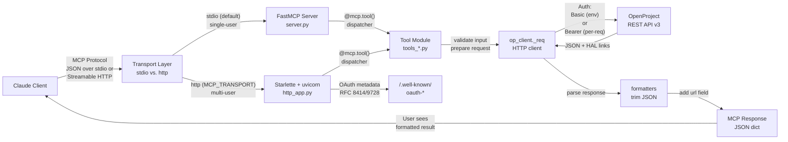

# System Architecture — openproject-mcp

## Request Flow Diagram


```mermaid
graph LR
    A["Claude Client"] -->|"MCP Protocol<br/>JSON over stdio or<br/>Streamable HTTP"| B["Transport Layer<br/>stdio vs. http"]
    B -->|"stdio (default)<br/>single-user"| C["FastMCP Server<br/>server.py"]
    B -->|"http (MCP_TRANSPORT)<br/>multi-user"| D["Starlette + uvicorn<br/>http_app.py"]
    C -->|"@mcp.tool()<br/>dispatcher"| E["Tool Module<br/>tools_*.py"]
    D -->|"@mcp.tool()<br/>dispatcher"| E
    E -->|"validate input<br/>prepare request"| F["op_client._req<br/>HTTP client"]
    F -->|"Auth:<br/>Basic (env)<br/>or<br/>Bearer (per-req)"| G["OpenProject<br/>REST API v3"]
    G -->|"JSON + HAL links"| F
    F -->|"parse response"| H["formatters<br/>trim JSON"]
    H -->|"add url field"| I["MCP Response<br/>JSON dict"]
    I -->|"User sees<br/>formatted result"| A
    D -->|"OAuth metadata<br/>RFC 8414/9728"| J["/.well-known/<br/>oauth-*"]
```

## Component Overview

### 1. FastMCP Server (`server.py`)

**Responsibility:** Entry point; transport dispatch (stdio vs. http); tool registration via side effects

```python
# Imports tools_*.py for @mcp.tool() registration
import tools_admin, tools_coder, tools_news, ...
from app import mcp
from config import resolve_transport

__version__ = "0.8.0"

def main() -> None:
    cfg = resolve_transport(os.environ)
    if cfg.transport == "http":
        _run_http(cfg)  # Starlette + uvicorn (multi-user)
    else:
        _run_stdio(cfg)  # FastMCP.run() (single-user, default)
```

**Characteristics:**
- ~85 LOC (grew with HTTP transport dispatch)
- Calls `mcp.run()` (stdio) or uvicorn.run (http)
- Logs startup info to stderr
- Transport configurable via `MCP_TRANSPORT` env var
- Tool registration happens at import time (side effects)

### 2. FastMCP App Instance (`app.py`)

**Responsibility:** Shared FastMCP instance for tool registration

```python
from mcp.server.fastmcp import FastMCP
mcp = FastMCP("openproject")
```

**Why separate?** Allows `tools_*.py` modules to import and decorate without circular imports.

### 3. Configuration (`config.py`)

**Responsibility:** Environment variables, transport config, admin allowlist rules, logging

```python
import os, logging, sys
from dataclasses import dataclass

BASE_URL = os.environ.get("OPENPROJECT_URL", "").rstrip("/")
API_KEY = os.environ.get("OPENPROJECT_API_KEY", "")  # Single-user only
TIMEOUT = float(os.environ.get("OPENPROJECT_TIMEOUT_SECONDS", "30"))

# Transport config
@dataclass(frozen=True)
class TransportConfig:
    transport: str  # "stdio" (default) | "http" (remote multi-user)
    host: str       # MCP_HOST (default 127.0.0.1)
    port: int       # MCP_PORT (default 8000)
    allowed_hosts: list[str]  # ALLOWED_HOSTS (production reverse proxy domains)
    allowed_origins: list[str]  # ALLOWED_ORIGINS (CORS for OAuth callback)
    public_url: str  # MCP_PUBLIC_URL (OAuth issuer; for Claude.ai web)

# Admin allowlist (transport-aware)
_DESTRUCTIVE_TOOLS = {
    "delete_work_package",
    "delete_news",
    "remove_member",
    "create_project",
    "update_project",
    "bulk_create_work_packages",
    "bulk_update_work_packages",
}

def is_destructive(tool_name: str) -> bool:
    """True if tool causes data loss or admin impact."""
    return tool_name in _DESTRUCTIVE_TOOLS

def admin_destructive_enabled(env) -> bool:
    """Default: stdio=all 44 tools, http=37 tools (destructive hidden).
    Override with OP_MCP_ENABLE_ADMIN_DESTRUCTIVE env var."""
    return _transport_of(env) != "http"  # default
```

**Key decisions:**
- No `.env` file (env vars only)
- TransportConfig: pure dataclass, test-friendly
- Logs to stderr (stdout reserved for MCP protocol)
- No API key in logs (only `api_key_set=True/False`)
- Timeout configurable per request
- Admin allowlist: 7 destructive tools, hidden on http remote by default (OP_MCP_ENABLE_ADMIN_DESTRUCTIVE toggles)

### 4. HTTP Client (`op_client.py`)

**Responsibility:** Shared httpx.Client, per-request credential flow, retry logic, error handling, pagination

**Per-Request Credential Flow (Multi-User HTTP Mode):**

```python
from contextvars import ContextVar

request_ctx = ...  # SDK sets this during tool dispatch (http mode)

def current_creds() -> Creds:
    """Resolve credential for current request.
    
    - http mode: reads Bearer token from request headers → passes to auth
    - stdio mode: falls back to OPENPROJECT_API_KEY env → Basic auth
    """
    override = _creds_override.get(None)  # Seam for testing/Phase 3B
    if override:
        return override
    
    req = _current_request()  # From SDK ContextVar
    bearer = _bearer_from_request(req)
    if bearer:
        # http mode: per-request identity
        return Creds(base_url=BASE_URL, bearer=bearer)
    elif API_KEY:
        # stdio mode: env credential (single-user, unchanged)
        return Creds(base_url=BASE_URL, auth=("apikey", API_KEY))
    else:
        # http mode but no credential → 401 unauthenticated
        raise AuthError("No credential found. Authenticate via OAuth.")
```

**Key exports:**

| Function | Purpose |
|----------|---------|
| `current_creds()` | Resolve per-request credential (Bearer or Basic auth) |
| `_req(method, path, **kwargs)` | Low-level request with auth, retry, error handling; transport-aware 409 |
| `_collection(path, **params)` | Paginated GET with offset/limit |
| `client` | Shared httpx.Client for connection reuse |

**Transport-Aware 409 Handling (Optimistic Locking):**

```python
def patch_wp_with_lock(wp_id: int, body: dict, lock_version: int | None = None) -> dict:
    """Update work package with optimistic locking.
    
    - stdio (single-user): 409 triggers auto-refetch + single retry (accept potential overwrite)
    - http (multi-user): 409 surfaces immediately to caller (strict, no silent overwrite)
    """
    is_http = config.is_http_transport()
    
    lv = lock_version if lock_version is not None else fetch_lock_version(wp_id)
    payload = {**body, "lockVersion": lv}
    try:
        return _req("PATCH", f"/work_packages/{wp_id}", json=payload)
    except ConflictError:
        if is_http:
            raise  # http mode: fail immediately (multi-user concurrent edit detected)
        # stdio mode: refetch + retry once
        lv = fetch_lock_version(wp_id)
        payload["lockVersion"] = lv
        return _req("PATCH", f"/work_packages/{wp_id}", json=payload)
```

**Retry Logic:**

```python
if method == "POST":
    # POST never retries (write-once semantics)
    return response
elif status in (429, 502, 503, 504):
    # GET/PATCH/DELETE retry once on transient failure
    wait_time = int(response.headers.get("Retry-After", "1"))
    sleep(wait_time)
    return retry_request()
```

**Error Handling:**

```python
if response.status_code == 401:
    raise AuthError("Unauthenticated. Re-authenticate via OAuth (http) or check API key (stdio).")
elif response.status_code == 403:
    raise ValueError("Insufficient permission. Your role lacks access...")
elif response.status_code == 404:
    raise ValueError(f"Not found: {path}")
elif response.status_code == 409:
    raise ConflictError("Optimistic lock mismatch; concurrent edit detected.")
```

### 5. Formatters (`formatters.py`)

**Responsibility:** Trim HAL+JSON responses, extract useful fields, convert timestamps

**Key helpers:**

| Function | Purpose |
|----------|---------|
| `_fmt_wp(api_response)` | Work package: id, subject, status, project, assignee, due, url |
| `_fmt_news(api_response)` | News: id, title, summary, created_on, url |
| `_href_id(link)` | Extract numeric ID from `/api/v3/users/42` |
| `_link_title(item, rel_name)` | Get linked item title (e.g., project name) |
| `iso8601_to_hours(duration)` | Convert ISO 8601 (PT2H) to float (2.0) |
| `_out(obj, plural=False)` | Wrap result dict with metadata |

**Example: `_fmt_wp`**

Input: HAL+JSON response from OpenProject API
```json
{
  "id": 123,
  "subject": "Fix login bug",
  "description": "...",
  "status": {"id": 1, "name": "New"},
  "project": {"id": 42, "name": "Website"},
  "assignee": {"id": 5, "name": "Alice"},
  "dueDate": "2026-06-15",
  "lockVersion": 3,
  "_links": {"self": {"href": "/api/v3/work_packages/123"}}
}
```

Output: Trimmed dict
```python
{
    "id": 123,
    "subject": "Fix login bug",
    "status": {"id": 1, "name": "New"},
    "project": {"id": 42, "name": "Website"},
    "assignee": {"id": 5, "name": "Alice"},
    "due_date": "2026-06-15",
    "url": "https://openproject.example.com/work_packages/123"
}
```

### 6. Validators (`validators.py`)

**Responsibility:** Pure validation for relation operations

**Key function: `validate_relation(source_id, target_id, relation_type)`**

Rejects:
- **Self-relation:** source == target
- **Duplicate:** already exists in either direction
- **Direct cycle:** `blocks` + `precedes` reversal (A blocks B, B precedes A = cycle)

**RELATION_TYPES**
```python
RELATION_TYPES = [
    "relates", "duplicates", "duplicated_by", "blocks", "blocked_by",
    "precedes", "follows", "includes", "partof", "requires", "required_by"
]
```

**Rationale:** Prevent invalid API calls; catch errors before network round-trip.

### 6. Admin Allowlist (`allowlist.py`)

**Responsibility:** Runtime tool filtering for remote (http) deployments

**Why separate?** Destructive actions (delete, bulk ops, project archive) can harm non-technical team members. On http remote, these 7 tools are hidden by default to prevent accidental misuse.

```python
def install(mcp) -> None:
    """Wrap FastMCP.list_tools() + call_tool() to filter destructive tools."""
    
    orig_list_tools = mcp.list_tools
    orig_call_tool = mcp.call_tool
    
    async def list_tools():
        tools = await orig_list_tools()
        if config.admin_destructive_enabled():
            return tools  # All 44 (stdio or admin override)
        return [t for t in tools if not config.is_destructive(t.name)]  # Filter to 37
    
    async def call_tool(name, arguments):
        if config.is_destructive(name) and not config.admin_destructive_enabled():
            raise ValueError(f"Tool '{name}' is disabled on this deployment.")
        return await orig_call_tool(name, arguments)
    
    mcp.list_tools = list_tools
    mcp.call_tool = call_tool
    mcp._mcp_server.list_tools()(list_tools)  # Wire both in-process + over-the-wire
    mcp._mcp_server.call_tool(validate_input=False)(call_tool)
```

**Tool Coverage:**
- **Destructive (hidden on http):** delete_work_package, delete_news, remove_member, create_project, update_project, bulk_create_work_packages, bulk_update_work_packages
- **Safe (always shown):** 37 remaining tools (read-only + single writes with confirmation)

**Override:** Set `OP_MCP_ENABLE_ADMIN_DESTRUCTIVE=true` to show all 44 tools (admin mode; use with caution).

### 7. OAuth Resource Server (`oauth_metadata.py`)

**Responsibility:** Serve RFC 8414 + RFC 9728 OAuth metadata endpoints

**Why?** Claude.ai web custom connectors use RFC 9728 to discover how to authenticate. The MCP doesn't store tokens (OpenProject is the auth server); it advertises OAuth endpoints and expects per-request Bearer tokens from Claude.

```python
# GET /.well-known/oauth-protected-resource
# GET /.well-known/oauth-authorization-server
# GET /.well-known/oauth-protected-resource (non-standard, also at /mcp-suffixed path)

# Returns:
{
    "issuer": "https://your-openproject.example.com",
    "authorization_endpoint": "https://your-openproject.example.com/oauth/authorize",
    "token_endpoint": "https://your-openproject.example.com/oauth/token",
    "resource_server": "https://<mcp-public-url>",
    "scopes_supported": ["api_v3"],
}
```

**Key fields:**
- `issuer` / `authorization_endpoint` / `token_endpoint` point to **OpenProject** (NOT the MCP)
- `resource_server` is the MCP itself (for per-request Bearer validation)
- OpenProject is the Authorization Server; MCP is the Resource Server

### 8. HTTP Transport (`http_app.py`)

**Responsibility:** Starlette ASGI app for multi-user Streamable HTTP transport

**Why separate?** Stdio and http modes need different request handling. Starlette app handles DNS-rebinding protection, request routing, and FastMCP Streamable HTTP dispatch.

```python
app = Starlette(
    routes=[
        Route("/mcp", fastmcp_http_handler, methods=["POST"]),
        Route("/.well-known/oauth-*", oauth_metadata_handler),
        Route("/health", health_check),
    ],
    middleware=[
        TransportSecuritySettings(
            allowed_hosts=cfg.allowed_hosts,
            allowed_origins=cfg.allowed_origins,
        ),
    ],
)
```

**Security:** TransportSecuritySettings blocks DNS-rebinding attacks and Origin mismatches (important for OAuth callback protection).

### 9-15. Tool Modules (`tools_*.py`)

**Pattern:** Each module imports `app.mcp`, decorates functions with `@mcp.tool()`, implements tool logic.

| Module | Tools | Area |
|--------|-------|------|
| `tools_work_packages.py` | 5 | Work package CRUD + comments |
| `tools_projects.py` | 7 | Projects, members, metadata |
| `tools_coder.py` | 3 | Hierarchy, relations |
| `tools_time.py` | 3 | Time tracking |
| `tools_reports.py` | 7 | Analytics & reporting |
| `tools_news.py` | 5 | News CRUD |
| `tools_admin.py` | 8 | User/role/project admin |

**Tool signature pattern:**
```python
@mcp.tool()
def create_work_package(
    project_id: int,
    subject: str,
    type_id: int = None,
    parent_id: int = None,
) -> dict:
    """Tạo work package mới. [Vietnamese docstring with all params]"""
    
    # Validate input
    if not subject.strip():
        raise ValueError("Subject cannot be empty")
    
    # Call API
    payload = {"subject": subject, "typeId": type_id, ...}
    response = _req("POST", f"/api/v3/projects/{project_id}/work_packages", json=payload)
    
    # Format & return
    return _fmt_wp(response.json())
```

## Request Lifecycle

### Example: `create_work_package`

```
1. Claude: "Create a task 'Fix login bug' in project 42"
   ↓
2. MCP Client dispatches to tool: create_work_package(project_id=42, subject="Fix login bug")
   ↓
3. Tool validates:
   - project_id is int ✓
   - subject is non-empty string ✓
   ↓
4. Tool calls op_client._req("POST", "/api/v3/projects/42/work_packages", json=...)
   ↓
5. _req builds request:
   - Base URL: https://openproject.example.com
   - Auth: Basic auth (username="apikey", password=API_KEY)
   - Timeout: 30s (or OPENPROJECT_TIMEOUT_SECONDS)
   ↓
6. httpx.Client sends over HTTP
   ↓
7. OpenProject API v3 responds:
   - Status 201 Created
   - Body: {"id": 999, "subject": "Fix login bug", ...}
   ↓
8. _req checks status:
   - 201 is success
   - Don't retry (POST never retries)
   - Return response object
   ↓
9. Tool calls formatters._fmt_wp(response.json())
   - Trim to essential fields
   - Extract url from _links.self.href
   ↓
10. Tool returns:
    {
        "id": 999,
        "subject": "Fix login bug",
        "project": {"id": 42},
        "status": {"name": "New"},
        "url": "https://openproject.example.com/work_packages/999"
    }
    ↓
11. MCP Client returns to Claude
    ↓
12. Claude: "Done! Created task #999 'Fix login bug' in project Website."
```

## Authentication Model

**OpenProject API v3 uses HTTP Basic Authentication:**

```
Authorization: Basic base64(apikey:TOKEN)
```

**Our implementation:**
```python
# In config.py
API_KEY = os.environ.get("OPENPROJECT_API_KEY")  # Personal token, 40 hex chars

# In op_client.py
client = httpx.Client(auth=("apikey", API_KEY), ...)
```

**Security:**
- Username always `"apikey"` (hardcoded)
- Password is token from env (never logged, never committed)
- All communication over HTTPS (enforced by OpenProject)
- If token leaked: revoke at `My account → Access tokens → API` and generate new one

## Idempotency & Retry Strategy

**Idempotent requests (can safely retry):**
- `GET` — read-only, safe to retry
- `PATCH` — update with optimistic locking via `lockVersion`, safe to retry
- `DELETE` — can retry if idempotent (some deletions have side effects; caution in guides)

**Non-idempotent requests (must NOT retry):**
- `POST` — creates new resource; retry risks duplicate (task, relation, time entry, member, news item)

**Implementation:**
```python
def _req(method, path, **kwargs):
    response = client.request(method, path, **kwargs)
    
    if method == "POST":
        # Never retry POST
        return response
    
    if response.status_code in (429, 500, 502, 503, 504):
        # Retry GET/PATCH/DELETE with exponential backoff
        wait_time = int(response.headers.get("Retry-After", "1"))
        sleep(wait_time)
        return client.request(method, path, **kwargs)
    
    return response
```

**Why?** OpenProject is slow during heavy load (429) or temporarily down (5xx). Transient failures hurt user experience. But duplicating a work package is worse than a timeout.

## Optimistic Locking

**Problem:** Two users edit a work package concurrently; one overwrites the other's changes.

**Solution:** `lockVersion` field

```python
# User A fetches work package #123
response = _req("GET", "/api/v3/work_packages/123")
data = response.json()
lock_version = data["lockVersion"]  # e.g., 3

# User A modifies locally
data["subject"] = "New title"

# User A sends update with lockVersion
payload = {
    "subject": "New title",
    "lockVersion": lock_version  # Must match server's version
}
response = _req("PATCH", "/api/v3/work_packages/123", json=payload)

# If User B edited meanwhile:
# - Server incremented lockVersion to 4
# - User A's PATCH with lockVersion=3 fails with 409 Conflict
# - User A retries: fetch fresh, merge, send with new lockVersion
```

**In our code** (`op_client.patch_wp_with_lock`): `lock_version` is optional — fetched on demand, and a 409 triggers one refetch+retry rather than bubbling up:
```python
def patch_wp_with_lock(wp_id: int, body: dict, lock_version: int | None = None) -> dict:
    lv = lock_version if lock_version is not None else _req("GET", f"/work_packages/{wp_id}").get("lockVersion")
    payload = {**body, "lockVersion": lv}
    try:
        return _req("PATCH", f"/work_packages/{wp_id}", body=payload)
    except ConflictError:                      # _req raises this on HTTP 409
        payload["lockVersion"] = _req("GET", f"/work_packages/{wp_id}").get("lockVersion")
        return _req("PATCH", f"/work_packages/{wp_id}", body=payload)  # retry once; 2nd 409 → raise
```
Trade-off: the auto-retry can overwrite a concurrent edit made between the two attempts — acceptable for single-actor (AI) use. `update_work_package` and `bulk_update_work_packages` both route through this helper.

## Module Dependency Graph

```
server.py (entry point)
    ↓ imports
tools_*.py (tools; @mcp.tool() side effects)
    ↓ imports
app.py (shared mcp instance)
config.py (env, logging)
op_client.py (HTTP)
formatters.py (JSON trim)
validators.py (relation guards)
```

**No circular imports:** Each level imports from previous, never upward.

## Error Handling Flow

```
Tool calls _req(method, path, ...)
    ↓
_req sends HTTP request
    ↓
Response arrives
    ↓
Check status code:
    ├─ 2xx (success) → return response
    ├─ 401 → raise ValueError("Invalid API key...")
    ├─ 403 → raise ValueError("Insufficient permission...")
    ├─ 404 → raise ValueError("Not found: {path}")
    ├─ 409 → raise ValueError("Conflict: lockVersion mismatch")
    ├─ 422 → raise ValueError("Validation failed: {errors}")
    ├─ 429/5xx (non-POST) → retry with Retry-After
    └─ 429/5xx (POST) → raise ValueError("Server busy; try again later")
    ↓
Tool catches ValueError
    ↓
Tool returns to MCP client with error message
    ↓
MCP client shows error to Claude
    ↓
Claude explains to user: "API key invalid. Generate a new one at..."
```

**Key:** Errors are user-friendly; no stack traces; actionable guidance.

## Concurrency & Performance

**Single-threaded:** FastMCP runs one tool at a time (stdio constraint).

**Connection reuse:** Shared `httpx.Client` reuses TCP connection (HTTP keep-alive).

**Timeout:** `OPENPROJECT_TIMEOUT_SECONDS` (default 30s) prevents hanging.

**Pagination:** `_collection` handles large result sets via offset/limit.

**Typical response time:** <1s for list/get; <3s for reports (depends on OpenProject instance).

## Deployment Model

### Single-User (Stdio, Default)

**No server process needed.**

- Claude Code: `claude --plugin-dir /path/to/openproject-mcp` (dev mode)
- Claude Code + marketplace: `/plugin install openproject-mcp@promete-plugins`
- Claude Desktop: Config in `claude_desktop_config.json`; runs on demand

**Startup:** `uv run --script server/server.py` starts FastMCP on stdio.

**Credentials:** `OPENPROJECT_URL` + `OPENPROJECT_API_KEY` from environment (unchanged from v0.7.0).

**Logs:** All logs go to stderr (visible in Claude Code console or Desktop dev tools).

### Multi-User (HTTP, Remote)

**Requires container + reverse proxy (HTTPS).**

- **MCP_TRANSPORT=http** enables Streamable HTTP (Starlette + uvicorn)
- Runs on `MCP_HOST` (default 127.0.0.1) and `MCP_PORT` (default 8000)
- Must be behind HTTPS reverse proxy (Caddy, nginx) for TLS
- `MCP_PUBLIC_URL` advertised in OAuth metadata (for Claude.ai web)
- `ALLOWED_HOSTS` + `ALLOWED_ORIGINS` required for production (DNS-rebinding protection)
- **No `OPENPROJECT_API_KEY`** (each user authenticates via OAuth to OpenProject)
- Tool count reduced to 37 (7 destructive tools hidden by default)
- Per-request Bearer token isolation via SDK ContextVar
- RFC 8414/9728 OAuth metadata at `/.well-known/oauth-*`

**Startup:**
```bash
uv run --script server/server.py
# Logs: "openproject-mcp v0.8.0 — transport=http, listening on 127.0.0.1:8000 (behind reverse proxy)"
```

**Reverse proxy example (Caddy):**
```caddy
openproject-mcp.example.com {
    reverse_proxy 127.0.0.1:8000
    tls user@example.com
}
```

Caddy auto-TLS; MCP sees request, reads OAuth token from Claude.ai.

### Why Two Paths?

- **Stdio (single-user):** Dev/personal use, minimal setup, env credentials
- **Http (remote multi-user):** Team deployments, OAuth per-request, tool safety filter, reverse-proxy HTTPS

## Security Boundaries

| Component | Trust Level | Notes |
|-----------|------------|-------|
| Claude client | Trusted | We assume Claude won't ask for keys |
| OpenProject API | Trusted | Credentials flow to it; validate all responses |
| Environment | Trusted | API key must be set; not hardcoded |
| Network | Partially trusted | Always use HTTPS; Basic Auth only secure over HTTPS |

**Assumptions:**
- OpenProject instance is HTTPS (enforce in production)
- API key holder is the authorized user
- No keys logged, printed, or returned in tool output
